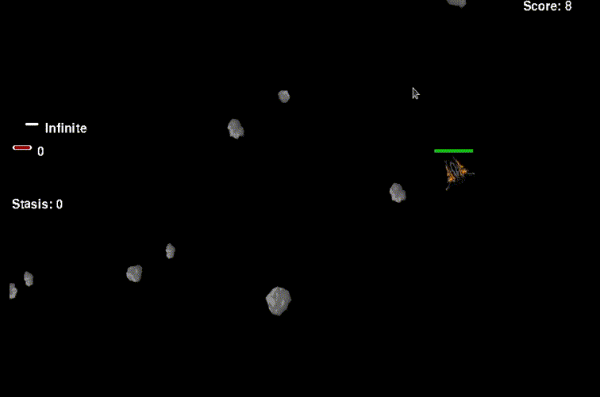

# Asteroids_pygame_tutorial

Репозиторий содержит код, написанный для лекций по разработке игр при помощи pygame на [онлайн-курсе](https://python-school.com/) по Python. 



# Описание

В ходе уроков происходит разбор следующих основных возможностей и концепций:

+ Объектно-ориентированное программирование на Python
+ Организация кода
+ Базовые возможности pygame: рисование, цикл событий, столкновения и т.д.
+ Основы линейной алгебры и тригонометрии

В ходе обучения создаётся игра с базовыми механиками, но открытая для расширения функционала.

В ходе уроков **не рассматривается**:

+ Работа со звуками в pygame
+ Высокоуровневые абстракции pygame (спрайты, рендер-группы)
+ "Упаковка" программы в исполяемый файл

## Описание скриптов

|      Имя скрипта       |                       Функции скрипта                        |
| :--------------------: | :----------------------------------------------------------: |
| create_build_script.py |     Создание скрипта для "упаковки" в исполняемый файл.      |
|     main_build.py      | Скрипт, готовый к "упаковке" в исполняемый файл.  Включает в себя "монтирование" папок с данными. |
|       config.py        | Конфигурационный файл игры. Содержит практически все настраиваемые параметры игры. |
|    main_build.spec     |        "Упаковочный" скрипт для работы с pyinstaller.        |
|   Lesson_X/step_X.py   | Код с последовательными шагами для каждого урока. Каждый урок разбит на 3-5 шагов. |
|        main.py         | Главный скрипт игры. Содержит весь код, ответственный за игровой процесс. |

В рамках курса рассматриваются только скрипты **Lesson_X/step_X.py**.

# Использование

## Запуск игры

Клонируйте репозиторий на ваш локальный компьютер

```bash
git clone https://github.com/krglkvrmn/Asteroids_pygame_tutorial.git
cd Asteroids_pygame_tutorial
```

Установите необходимые зависимости

```bash
pip install -r requirements.txt
```

Запустите скрипт **main.py** (протестировано на python 3.6-3.9).

```bash
python main.py
```

Игру также можно запустить сразу через исполняемый файл. Для этого нужно скачать последнюю версию программы из раздела [releases](https://github.com/krglkvrmn/Asteroids_pygame_tutorial/releases) данного репозитория.

## Внутриигровое управление

* Корабль игрока следует за курсором мыши
* Стрельба - **ЛКМ** или **ПКМ**
* Смена оружия - **Пробел**
* Активация "стазиса" - **s**
* Выход из игры - **Esc**
